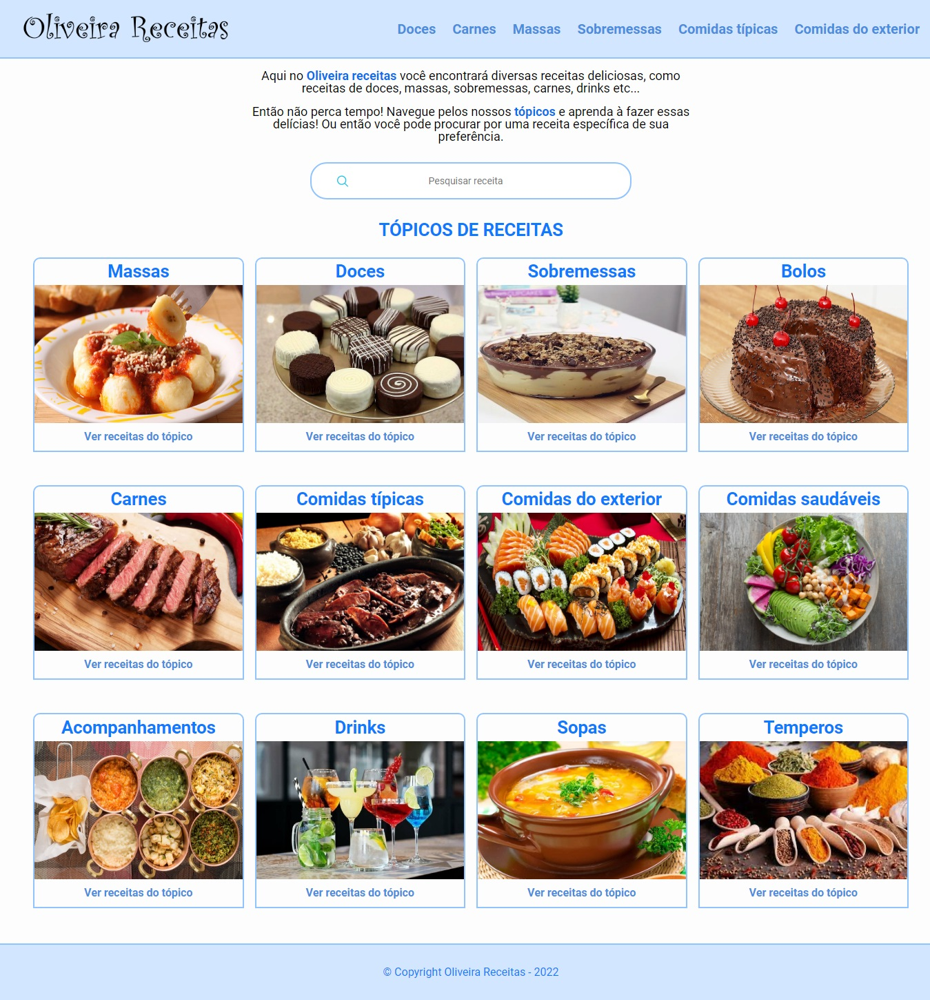

<h1 align="center">👨‍🍳 Oliveira Receitas 👩‍🍳</h1>

  

## Tópicos
- [Imagem do projeto](#img)
- [Acesso ao projeto](#acesso)
- [Descrição do projeto](#desc)
- [Tecnologias utilizadas](#tec)
- [Status do projeto](#status)
- [Desenvolvedor do projeto](#dev)
- [Licença](#license)

 

<h2 id="img">🖥️ Imagem do projeto</h2>

    

 

<h2 id="acesso">⚓ Acesso ao projeto</h2>

Acesse o projeto clicando [aqui](https://fel1324.github.io/Oliveira-Receitas/).

 

<h2 id="desc">💻 Descrição do projeto</h2>

O Oliveira Receitas se trata de um site que apresenta alguns tópicos de receitas deliciosas que a maioria das pessoas gostam.

 

<h2 id="tec">🚀 Tecnologias utilizadas</h2>

* HTML e CSS
* Javascript
* Git e Github

 

<h2 id="status">🏗️ Status do projeto</h2>

✔️ Projeto Finalizado

 

<h2 id="dev">👨‍🚀 Desenvolvedor do projeto</h2>

* Rafael Roberto de Oliveira

 

<h2 id="license">📝 Licença</h2>

Esse projeto está sob a licença MIT.
